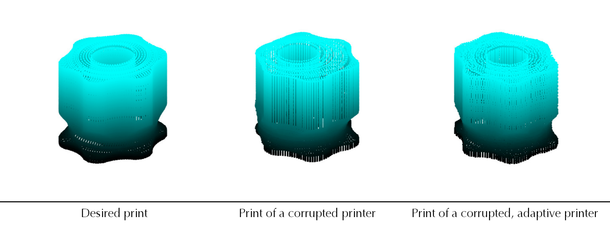

# Utilizing a Malfunctioning 3D Printer by Modeling Its Dynamics with Artificial Intelligence

The official repository for the paper **Utilizing a Malfunctioning 3D Printer by Modeling Its Dynamics with Artificial Intelligence**.



Robustness of the machines is an important research area, especially in fields like space exploration, where a human is not able to manually inspect and fix it.
In that situation, the longetivity of the machine can be improved by teaching the machine to repair itself. Most parts can be assembled with the help of the 3d printer. 
However, if the printer is corrupted, this self-repairing ability is lost. 
To prevent this we develop a systems that allows to effectively use the 3d printer even after corruption. 

The paper has been presented at the [ICRA 2024](https://2024.ieee-icra.org/) conference.

Link to the paper:


## Usage and reproduction

All scripts are called from the main project directory.

The zipped dataset is in the repository. However, after cloning it has to be unzipped

```
unzip data/compressed/dataset.zip -d data/
```

To reproduce the results run

```
export PYTHONPATH=.
python src/evaluate.py $MODEL_NAME
```
where `$MODEL_NAME` is a type of model to evaluate, can be chosen from:
 - **naive** - standard, non-adaptive printer 
 - **oracle** - a printer that perfectly knows the type of corruption that happened and how it will affect the control
 - **rf** - random forest estimator of the dynamics of the system (and therefore the corruption) that is used for adaptive control
 - **independent_rf** - random forest estimator with the assumption that the dimensions are independent
 - **lgb** - lightgbm estimator of the dynamics of the system (and therefore the corruption) that is used for adaptive control
 - **independent_lgb** - lightgbm estimator of the dynamics of the system with the assumption that the dimensions are independent
 
The **ABRMSE** results will be printed as well as saved in the `results/$MODEL_NAME.out` file.

## Contact details
- Renzo Caballero - Renzo.Caballero@kaust.edu.sa
- Piotr Piękos - Piotr.Piekos@kaust.edu.sa


